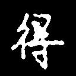
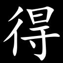
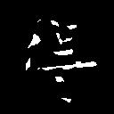
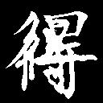
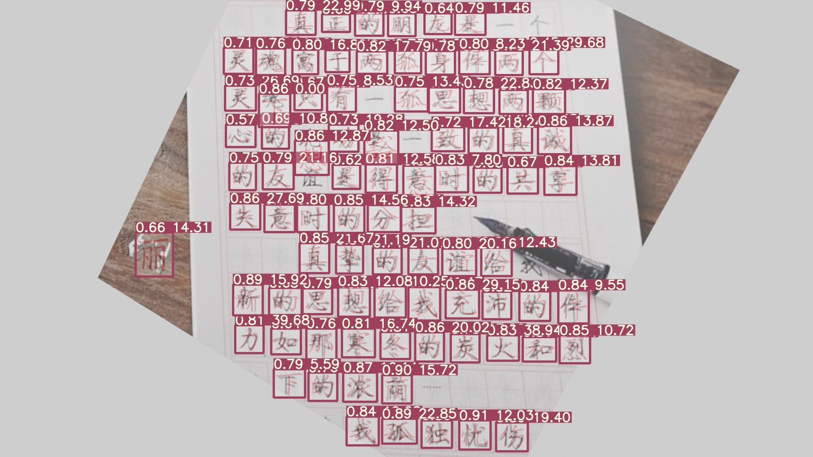

# Chinese-character-detection-and-recognition
With Yolov5 and a simple CNN, this project can detect and recogize black chinese characters on white paper.

With the detected boxes and predicted labels, a standard character with font `simka.ttf` can be easily generated, before the score is calculated.

<center>

|source|standard|
|:-:|:-:|
|||
|matched|total|
|||

</center>
The matched map shows the pixels that the tow maps above have in common, while total map is the result of adding them.

Than, the score is calculated.
$$
score = \frac{number\ of\ matched\ pixels}{number\ of\ total\ pixels}
$$

# Usage
```shell
python run.py --save-txt --conf 0.25 --iou 0.1
```
If everything gose fine, you can get the output like this.
```
Namespace(agnostic_nms=False, augment=False, classes=None, conf_thres=0.25, device='', exist_ok=False, img_size=640, iou_thres=0.1, name='exp', project='runs/detect', save_conf=False, save_txt=True, source='single_word/imgs/', update=False, view_img=False, weights='single_word/weights/yolov5s.pt')
YOLOv5 181b015 torch 1.7.1+cu110 CUDA:0 (GeForce 940MX, 2048.0MB)

Fusing layers...
Model Summary: 224 layers, 7053910 parameters, 0 gradients, 16.3 GFLOPS
image 1/1 some_path_to\single_word\imgs\test.jpg: 384x640 Done. (0.066s)
Results saved to runs\detect\exp
1 labels saved to runs\detect\exp\labels
Done. (1.934s)
```
Similar to yolo's label ouput, the results in the above lable path is a `txt` file. With a `score` added, each row is `class` `x_center` `y_center` `width` `height` `score` format.  
`class` is alwsay `0`, since only one class named `word` is set.  
Box coordinates are in normalized xywh format (from 0 - 1).

# Result
|original|processed|
|:-:|:-:|
|||

The standard character will be printed to corresponding area, with a confidence and a score for each detected boxes.